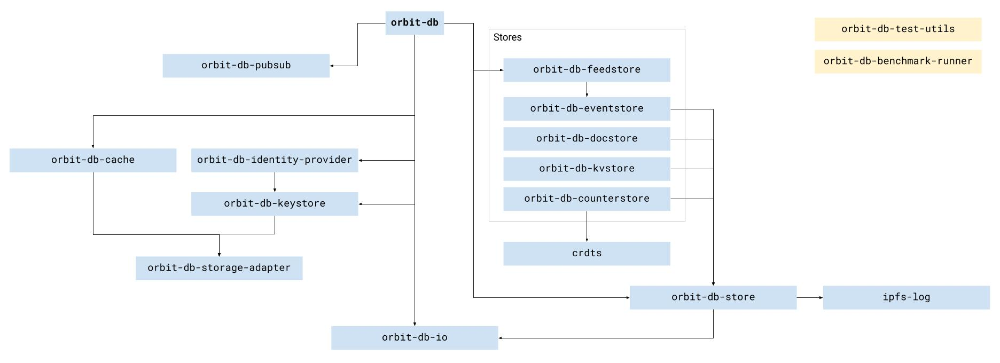

# Welcome to OrbitDB!

> ☄️💫 The OrbitDB community and documentation repo

[`orbit-db`](https://github.com/orbitdb/orbit-db) is a serverless, distributed, peer-to-peer database. `orbit-db` uses [IPFS](https://ipfs.io/) as its data storage and [IPFS Pubsub](https://github.com/ipfs/go-ipfs/blob/master/core/commands/pubsub.go#L23) to automatically sync databases with peers. It's an eventually consistent database that uses [CRDTs](https://en.wikipedia.org/wiki/Conflict-free_replicated_data_type) for conflict-free database merges making `orbit-db` an excellent choice for offline-first applications.

This organization is a place to bring together all of the Orbit repositories, and to work together on making orbit better. This repo is the center of that organization.

## Table of Contents

<!-- START doctoc generated TOC please keep comment here to allow auto update -->
<!-- DON'T EDIT THIS SECTION, INSTEAD RE-RUN doctoc TO UPDATE -->

- [Biweekly Calls](#biweekly-calls)
- [Repositories](#repositories)
  - [Code-free repositories](#code-free-repositories)
  - [OrbitDB](#orbitdb)
  - [Orbit Chat](#orbit-chat)
  - [Multilingual Implementations](#multilingual-implementations)
  - [Other repositories?](#other-repositories)
  - [Naming](#naming)
- [Registries](#registries)
- [Contribute](#contribute)
- [License](#license)

<!-- END doctoc generated TOC please keep comment here to allow auto update -->

## Calls

We sometimes have community calls. At the moment, these are in abeyance. However, if you feel that it would be good to have a call with the OrbitDB community, simply open an issue and ask if others would like to join in.

We do not record these calls, as we want people to feel comfortable joining in and talking without worrying about being recorded. Old notes for meetings are in `meeting-notes`.

## Repositories

The [@orbitdb](https://github.com/orbitdb) organization on GitHub contains many different repositories. For the most part, these fall into three categories: code which relates to OrbitDB, the peer to peer database for the decentralized web; Orbit Chat, a decentralized chat program built using OrbitDB; and various non-code repositories.

### Code-free repositories

- The **[welcome](https://github.com/orbitdb/welcome)** community repo, which you're in right now;
- **[awesome-orbitdb](https://github.com/orbitdb/awesome-orbitdb)**, which is an attempt to list everything that is using OrbitDB, or could help people. Basically, what has been built? And;
- **[research](https://github.com/orbitdb/research)**, where you can find research papers and interesting research work on CRDTs and the like.
- **[logo](https://github.com/orbitdb/logo)**, Orbit's brand files, formats and guidelines

### OrbitDB

OrbitDB is a peer-to-peer database for the decentralized web (to put it succinctly). The most important repositories are:

- **[orbit-db](https://github.com/orbitdb/orbit-db)** - The main repo for OrbitDB.
- **[ipfs-log](https://github.com/orbitdb/ipfs-log)** -  The most important module used by OrbitDB.

There's also at least one workshop you can try out:

- **[web3-workshop](https://github.com/orbitdb/web3-workshop)** - A workshop showing how to build a basic app using OrbitDB. This workshop was presented at the OrbitDB session during the #Web3 summit in Berlin, in August 2019.

And then, there are a whole host of modules. It should be noted that **all** of these are JavaScript modules on npm.

- **[crdts](https://github.com/orbitdb/crdts)** - A library of [Conflict-Free Replicated Data Types](https://en.wikipedia.org/wiki/Conflict-free_replicated_data_type) for JavaScript. Used in [orbit-db-counterstore](https://github.com/orbitdb/orbit-db-counterstore); mostly just one function is used.
- **[orbit-db-cache](https://github.com/orbitdb/orbit-db-cache)** - Actually a persistency layer, not a cache. Saves the latest HEAD of each db locally into LevelDB. Doesn't store a huge amount of data, just the amount of DBs you have. For all of the dbs you have locally, you have a hash for each.
- **[orbit-db-cli](https://github.com/orbitdb/orbit-db-cli)** - CLI for OrbitDB.
- **[orbit-db-counterstore](https://github.com/orbitdb/orbit-db-counterstore)** - Datastore in OrbitDB. Uses CRDTs, inherits from [orbit-db-store](https://github.com/orbitdb/orbit-db-store).
- **[orbit-db-docstore](https://github.com/orbitdb/orbit-db-docstore)** - Another OrbitDB store which allows you to index a blob.
- **[orbit-db-eventstore](https://github.com/orbitdb/orbit-db-eventstore)** - Another data model type. Like [ipfs-log](https://github.com/orbitdb/ipfs-log). Wraps into a store interface.
- **[orbit-db-feedstore](https://github.com/orbitdb/orbit-db-feedstore)** - Database type in OrbitDB. This is exactly like eventlog, but you can delete events from the log.
- **[orbit-db-keystore](https://github.com/orbitdb/orbit-db-keystore)** - Keystore is actually a module that stores the keys locally. You can generate keys, it persists them in the data folder, you can import and export keys - it is basically a key manager.
- **[orbit-db-kvstore](https://github.com/orbitdb/orbit-db-kvstore)** - KeyValue store. Another DB type in OrbitDB. This may occasionally be unclear in the code, where `kvstore` is called `keyvalue` store.
- **[orbit-db-pubsub](https://github.com/orbitdb/orbit-db-pubsub)** - Message propagation module for OrbitDB. A layer between OrbitDB and IPFS Pubsub.
- **[orbit-db-store](https://github.com/orbitdb/orbit-db-store)** - Base class for OrbitDB data stores. A Base Class defines the common interface for all databases.
- **[orbit-db-test-utils](https://github.com/orbitdb/orbit-db-test-utils)** - Reusable utilities for automated testing across the OrbitDB stack
- **[orbit-db-benchmark-runner](https://github.com/orbitdb/benchmark-runner)** - Benchmark runner for compatible orbit-db repositories.
- **[orbit-db-storage-adapter](https://github.com/orbitdb/orbit-db-storage-adapter)** - Adapter for any leveldown-compliant store
- **[orbit-db-io](https://github.com/orbitdb/orbit-db-io)** - IO helper module used within OrbitDB

### Orbit Chat

And then there is the Orbit Chat, which is a chat program built on top of OrbitDB. These will most likely be renamed at some point to stop the confusion. The most important repository is:

- **[orbit-web](https://github.com/orbitdb/orbit-web)** - The browser client of Orbit Chat.

Other repositories include:

- **[orbit](https://github.com/orbitdb/orbit)** - This is a landing page repo, without code, and may be the start for a new Orbit Chat org if we end up making one. It needs to be updated.
- **[orbit-core](https://github.com/orbitdb/orbit-core)** -
The JavaScript npm module that implements the Orbit Chat protocol.
- **[orbit-electron](https://github.com/orbitdb/orbit-electron)** - Desktop application for Orbit Chat. Uses orbit-core and IPFS.
- **[orbit-textui](https://github.com/orbitdb/orbit-textui)** - A terminal client for Orbit Chat.
- **[orbit-bot](https://github.com/orbitdb/orbit-bot)** - Unsurprisingly, a bot for Orbit Chat.

### Multilingual Implementations

There has been a recent explosion of awesome, ambitions, community-driven work towards interoperability with other languages. First came the **[orbit-db-http-api](https://github.com/orbitdb/orbit-db-http-api)**, followed by **[py-orbit-db-http-client](https://github.com/orbitdb/py-orbit-db-http-client)**, and  **[go-orbit-db](https://github.com/berty/go-orbit-db)**.

These repos started as community efforts and were brought into the organization soon after. However, search GitHub - there's a lot more.

The best place to find out what is available is likely by asking in the [Gitter](https://gitter.im/orbitdb/Lobby). If you know of any other repos that ought to be included in this section, point them out to us!

### Other repositories?

There are other repositories that aren't in the organization around the web which are important - for instance, of course, [ipfs](https://github.com/ipfs/ipfs). For now, these are the main ones in the @orbitdb organization.

If there is something missing form this list, please let us know! Either open a PR or an issue, and we'll add it. Thank you.

### Naming

Why "OrbitDB"? Because it was available on GitHub, and it matches [`orbitdb`](https://github.com/orbitdb/orbit-db). Why "Orbit"? Because that is the name of [the chat app built on top of orbit-db](https://github.com/orbitdb/orbit). Why was that called "Orbit"? You'll have to ask [@haadcode](https://github.com/haadcode), but it's probably something to do with the [InterPlanetary File System (IPFS)](https://github.com/ipfs/ipfs).

There are variants of the name. For now, the canonical versions are: OrbitDB for the general project, `orbit-db` for the codebase at `orbitdb/orbit-db`, `@orbitdb` for the organization, and Orbit Chat for what used to be called just Orbit.

## Registries

We maintain OrbitDB accounts on these registries:
- [npm @orbitdb](https://www.npmjs.com/org/orbitdb)
- [DockerHub @orbitdb](https://hub.docker.com/u/orbitdb)

## Contribute

Please contribute! [Dive into the issues](https://github.com/orbitdb/orbitdb/issues)!

Check out our [contributing document](contributing.md) for more information on how we work, and about contributing in general. Please be aware that all interactions related to OrbitDB are subject to the OrbitDB [Code of Conduct](CODE_OF_CONDUCT.md).

Small note: If editing the README, please conform to the [standard-readme](https://github.com/RichardLitt/standard-readme) specification.

This repository is maintained by [@RichardLitt](https://github.com/RichardLitt). If you've got any questions for him, feel free to open an issue or a pull request, or to [email him](mailto:richardlitt@orbitdb.org) privately. we're always looking for more maintainers!

## License

This repository is only for documents. All of these are licensed under the [CC-BY-SA 3.0](LICENSE) license © 2016-2018 Protocol Labs Inc., Haja Networks Oy. Any code is under a [MIT](LICENSE) © 2016-2018 Protocol Labs Inc., Haja Networks Oy.
